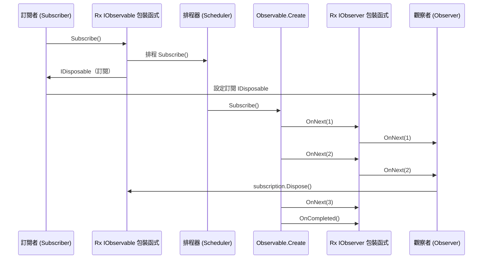

```mermaid
sequenceDiagram
    participant Subscriber as 訂閱者 (Subscriber)
    participant SrcWrapper as Rx IObservable 包裝函式
    participant Scheduler as 排程器 (Scheduler)
    participant Observable as Observable.Create
    participant RcvWrapper as Rx IObserver 包裝函式
    participant Observer as 觀察者 (Observer)
    Subscriber->>SrcWrapper: Subscribe()
    SrcWrapper->>Scheduler: 排程 Subscribe()
    SrcWrapper->>Subscriber: IDisposable（訂閱）
    Subscriber->>Observer: 設定訂閱 IDisposable
    Scheduler->>Observable: Subscribe()
    Observable->>RcvWrapper: OnNext(1)
    RcvWrapper->>Observer: OnNext(1)
    Observable->>RcvWrapper: OnNext(2)
    RcvWrapper->>Observer: OnNext(2)
    Observer->>SrcWrapper: subscription.Dispose()
    Observable->>RcvWrapper: OnNext(3)
    Observable->>RcvWrapper: OnCompleted()
```